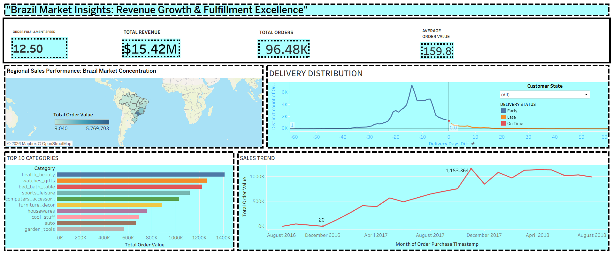

****🚀 Brazil Market Insights: Revenue Growth & Fulfillment Excellence**

Excited to share my latest data analytics project analyzing the Brazilian E-commerce market using the Olist dataset!

**DASHBOARD OVERVIEW**

📊 **Key Highlights:**

💰 Total Revenue: $15.42M
📦 Total Orders: 96.48K
🛒 Average Order Value: $159.8
🚚 Average Fulfillment Speed: 12.5 days

**🛠 Tools Used:**

Python (Data Cleaning & Feature Engineering)

Pandas(Extensive python library for data cleaning)

Tableau (Dashboard & Visualization)

**KPI & Business Intelligence Analysis**

This project demonstrates how raw transactional data can be transformed into actionable business insights for:

✔ Revenue optimization
✔ Regional expansion strategy
✔ Category performance analysis
✔ Logistics efficiency improvement

#DataAnalytics #BusinessIntelligence #Tableau #Python #Ecommerce #DataVisualization #AnalyticsProject #SupplyChain #MachineLearning #PortfolioProject
**
